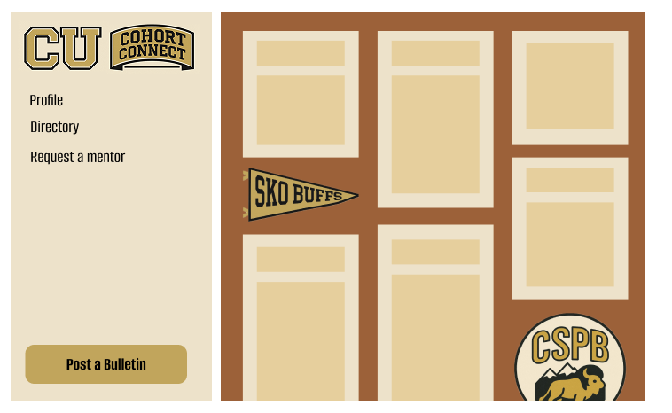

#  CSPB Cohort Connect

CU CSPB Cohort Connect aims to connect current and past students in CU's computer science post-bacc program.

## Weekly Updates
### Week 6
This week I got started with Docker. Before this week I had an extremely limited understanding of what Docker was and its use cases. To fully understand Docker, I watched a crash course tutorial geared towards beginners on YouTube, started a LinkedIn Learning course on Docker and looked into how to use Docker with SpringBoot (my chosen backend framework) and Postgres (which I will use for my database). Since I plan to use Docker for all three of my applications, I will use Docker Compose, which from my research, is the recommended way of dealing with multiple Docker containers across your backend, frontend, and database. I also am considering using Volumes, but will need to do more looking into it.

I also did some looking into file systems and how to use repositories when you are working across multiple applications, as I am getting to a point where I need to start working on my frontend and database. I think, because I am solo, I will make a mono repo where I keep my api, my frontend React app, and my database. It seems like this is a good option for versioning as well as organization. If anyone has any arguments against a single repository for an entire full-stack app, I’d be open to hearing it, though!

This week, I think I did a good job of diving headfirst into a technology that I had virtually zero understanding of. However, I think trying to understand how to use Docker in Postgres took my down a rabbit hole and I should have focused on only understanding Docker and its interaction with Spring Boot.

I put the creation of the database and setting up Postgres on pause this week for the Docker deep dive, so next week I will need to build out my database (also using docker and Postgres).

---

### Week 5
This week in addition to updating my personal portfolio I got started on both the design for the front-end of my website and the back-end database.

I have decided to structure my site, Cohort Connect, similarly to a virtual bulletin board. I got a little carried away with the front-end design and worked ahead a little further than wire framing. For my back-end I want to keep things fairly simple. As of now, I have three main tables; bulletin, user, and reply. Users will be able to post bulletins of certain types, with a title and content. Users with admin privileges will be able to perform CRUD operations on all bulletins, while users without admin privileges will be able to create and read all bulletins, but can only update and delete their own bulletins.

This week I think it was a good idea to jump into the designs of everything so I know exactly what my back-end should look like. This next week, I want to build the tables using SQL and populate them with data. I also want to start building the endpoints using the Spring Boot instance I initiated last week. By the end of next week I want to be able to perform CRUD operations on my DB. The only blocker I have at the minute is time and getting everything done in the next half of the semester. 

| bulletin                                               | reply                                               | user                                                             |
|--------------------------------------------------------|-----------------------------------------------------|-------------------------------------------------------------------|
| id [pk] (int)                                          | id [pk] (int)                                       | id [pk] (int)                                                    |
| type (enum: event, announcement, question, misc.)      | bulletin_id [fk] (int)                              | type (enum: current_student, former_student, admin)              |
| posted_on (datetime)                                   | posted_on (datetime)                                | email (varchar(45))                                             |
| posted_by [fk] (int)                                   | posted_by [fk] (int)                                | password (varchar(45))                                          |
| title (varchar(120))                                   | content (varchar(450))                              | display_name (varchar(20))                                     |
| content (varchar(450))                                 |                                                     | mentor_to [fk] (int)                                           |
|                                                        |                                                     | mentored_by [fk] (int)                                         |
|                                                        |                                                     | looking_for_mentor (bool)                                     |
|                                                        |                                                     | looking_for_mentee (bool)  

---

### Week 4
This week I continued practicing Java and worked on learning how to use the Spring Boot framework. I initialized my first Spring Boot project and added the dependencies Spring Web (allows for creation of REST APIs) and Spring Boot DevTools (allows hot reload during development). I am sure I will find more dependencies to add as I learn more about Spring Boot and deeper into development. I was able to get my first endpoint created and see it on my local host. 

I also worked on getting my development environment set up. I made sure I had a recent version of Java installed on my machine and I installed Maven. I will probably use VS Code for most development, so I installed some tools I found that help with Java development including Language Support for Java by Red Hat, Maven for Java, Debugger for Java, and Project Manager for Java. 

I think I made a good decision to not get too caught up on understanding Java perfectly before getting started on creating my application and diving into Spring Boot. This will allow me to learn as I go and not fall behind my schedule. For next week I want to have completed the DB design for my page so I can create the necessary endpoints in Java using Spring Boot.

---
### Week 3
This week I worked on finalizing my project proposal. I decided to pursue the idea I mentioned last week of building a full stack web application that connects current and past students of the CSPB program using Java as the back-end. I’ve gotten started with learning Java on Codecademy and some quick “learn Java” videos on YouTube. In my learning process I also did some research on why Java is such a popular language in the tech industry, which reinforced my desire to learn it before graduating. The most significant aspect of Java that has kept it popular for 30 years is the Java Virtual Mach (JVM), which allows the same Java code to run on different operating systems. Additionally, Java runs very fast for a programming language that does its own garbage collection and it is notably a very secure language. 

In the next week, I aim to keep learning the basics of Java, get a Spring Boot instance created, and start planning the front-end features and database for my site. 

---
### Week 2
I am late to join the class, so I am sure I will update my project as time progresses and as I have more time to think about it, but thus far I have come up with a goal of my project and a very brief time line of what I want to accomplish. I appreciate the emphasis this class puts on networking, but I also am about to graduate so I wanted a project that encompasses both my programming skills and connection with other students. 

**Goal:** My aim is to learn the programming language Java and some associated frameworks (Spring Boot) and build tools (Maven vs. Gradle) and deploy a full stack app that called CU CSPB Cohort Connect that aims to connect current and past students in the post-bacc program. The app will allows students to share resources, host study events, and connect in an environment not modded by professors. The app will also help past students stay in contact with not only each other, but set up potential mentor opportunities. This will be an open-source project, so once I am finished with the semester, I am hoping management could be passed down to current students. 

**Schedule:**
Week  2-3: Learn Java and Spring Boot, start initial planning for design 

Week 4-5: Database design and Spring Boot initialization 

Week 6-7: User management and auth (Spring Boot Security with JWT)

Week 8-9: CRUD events 

Week 10-11: Build frontend and API integration

Week 12-13: Deploy and polish

## Project Proposal
### Vision Statement
My goal with this project is to learn Java and apply that knowledge by building and deploying a full-stack web application that connects current and past students in the post-baccalaureate program. Using the associated Java framework Spring Boot and the build tool Maven, I will create a platform where students can share resources, host study events, and connect in an environment independent of professors. The app will also help past students stay in contact with not only each other, but set up potential mentor opportunities with current students. This will be an open-source project, so once I am finished with the semester, I am hoping management could be passed down to current students. 

### Motivation
I appreciate the emphasis this class places on networking, but I will be graduating after this semester, so I want to undertake a project that demonstrates my programming abilities and repository management skills, while also building connections with other students. I am choosing to learn Java and build my project in the language, because of its prevalence in the tech industry.

### Deliverables
I. Become sufficient at programming Java

*Deliverable:* Design and build a back-end API that is able to appropriately interact with an SQL database using Java and its frameworks. 

II. Build a front-end in React and utilize SQL to connect the front-end to the back-end

*Deliverable:* Have an interactive user interface front-end tied that allows users to perform the appropriate CRUD operations on an SQL database. 

III. Utilize AWS tools to deploy a full-stack web application

*Deliverable:* Successfully create a continuous integration/deployment environment using CodeDeploy, an AWS deployment automation tool. 

IV. Network with other students and encourage them to use the platform

*Deliverable:* Have several active student users in the last weeks of class. This could be analyzed by a traffic tool like Google Analytics. 

### Risks to project completion, possibly including:
#### I. New language and frameworks

I have never programmed in Java or used its frameworks and build tools. Additionally, I have never worked with AWS deployment tools that require an EC2 instance, which could add overhead to the project. 

#### II. Undertaking building an entire full-stack website within 45 hours 

Designing and building a full-stack site takes a lot of time. Making all of the moving pieces (front-end, back-end, database) fit together can be a challenge even without a time constraint. 

### Mitigation strategy for the risks listed above

#### Risk I Mitigation 

- I have a lot of experience with other object oriented languages. The similarities between languages I do know (JavaScript, C++, C) will help me pick up the language quickly.  
- My professional background as a web developer will allow me to spend less time learning front-end tools like React and  more time learning Java and its frameworks.

#### Risk II Mitigation 

- Diligently following the timeline I’ve included below will allow me to use my time efficiently and avoid falling behind.

### Project assessments - provide a list of evaluation criteria for the project
- The website is deployed and live. 
- The website is interactive on the front-end and allows users to perform CRUD operations on the database. 
- The website employs a Java back-end to interact with the SQL database. 
- Classmates are able to use the website to interact with one another. 

### Timeline
Week 2-3: Learn Java and Spring Boot, start initial planning for front-end design

Week 4-5: Database design and Spring Boot initialization, finalize front-end design

Week 6-7: User management and auth (Spring Boot Security with JWT)

Week 8-9: CRUD events 

Week 10-11: Build frontend and API integration

Week 12-13: Deploy and polish

